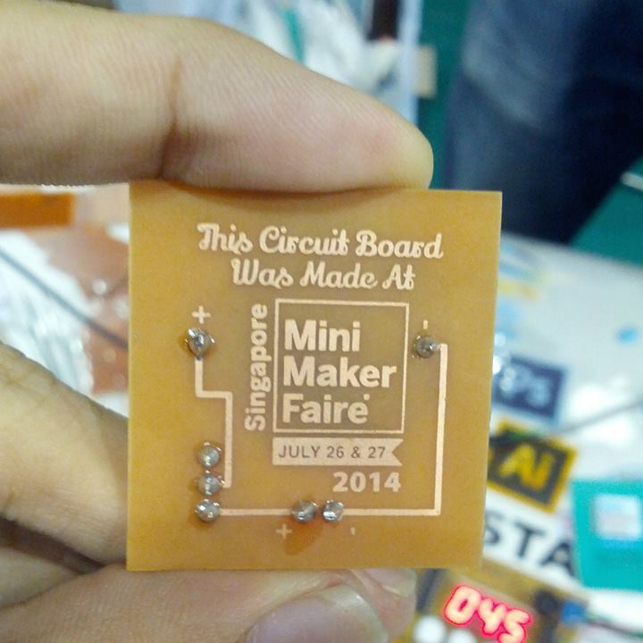

**[Introduction [0:35]](#t=0:35)**

- [Circuit Board Man](http://www.ba0sh1.com/singapore-mini-maker-faire-2014-visitor-maker/)
- [RaspiberryPi Big Check](https://www.facebook.com/photo.php?fbid=10203106707453070&set=gm.1410141059239575&type=1&theater)
- [Touch and Print](http://www.touch-print.com.sg/)

**[getting started with hobbyist electronics [4:07]](#t=4:07)**

- [Arduino Uno](http://arduino.cc/en/Main/arduinoBoardUno)
- [PIC Microcontroller](http://www.microchip.com/pagehandler/en-us/products/picmicrocontrollers)
- [Microcontroller Burner/Programmer](http://www.microchip.com/Developmenttools/ProductDetails.aspx?PartNO=DV007004)
- [Toner](http://en.wikipedia.org/wiki/Toner)
- [Toner Transfer Method](http://makezine.com/projects/pcb-etching-using-toner-transfer-method/)
- [Tone Transfer Method Ironing](http://www.youtube.com/watch?v=dvLRrXjktbE)
- [Agatha Lee](http://www.greenissuessingapore.blogspot.com)
- [Uyii](http://uyii.com.sg/)
- [Lillypad](http://arduino.cc/en/Main/arduinoBoardLilyPad)
- [Conductive Thread](https://www.sparkfun.com/products/10867)
- [Element14](http://element14.com/)
- [Adobe Illustrator](http://www.adobe.com/sea/products/illustrator.html)

**[spreading digital arts [24:23]](#t=24:23)**

- [Creative CrewSG](https://www.facebook.com/CreativeCrewSG)
- [William Hooi](http://live.webuild.sg/021-william-hooi/)
- [Canva](https://www.canva.com/)
- [Pixlr](http://pixlr.com/)
- [Photoshop User TV](http://kelbytv.com/photoshopusertv/)
- [Scott Kelby](http://scottkelby.com/)
- [Corey Barker](http://coreybarker.squarespace.com/)
- [Pixel Perfect](http://revision3.com/pixelperfect/)
- [Bert Monroy](http://www.bertmonroy.com/)
- [Real World Illustrator](http://rwillustrator.blogspot.sg/p/books.html)
- [Illustrator Wow Book](http://www.peachpit.com/store/adobe-illustrator-cs6-wow-book-9780321841766)

**[I/O Polling audience questions [35:07]](#t=35:07)**

- [Material Design](http://www.google.com/design/spec/material-design/introduction.html)
- [3D Printing](http://en.wikipedia.org/wiki/3D_printing)
- [MakerBot](http://www.makerbot.com/)

**[Rapid Fire questions [41:10]](#t=41:10)**

- [Collin Furze Wolverine](http://www.youtube.com/watch?v=sdcGek-NoFQ)
- [AngularJS](https://angularjs.org/)
- [SGMakers Meetup](https://www.facebook.com/sgmakers)
- [Creative CrewSG](https://www.facebook.com/CreativeCrewSG)
- [Making Wolverine Claws](http://www.youtube.com/watch?v=fVBCFGebqTg)
- [Raspberry Pi B+](http://www.raspberrypi.org/product/model-b-plus/)

**[Doubly Linked List -  New releases [39:22]](#t=39:22)**

- [Raspberry Pi B+](http://www.raspberrypi.org/product/model-b-plus/)
- [What's new in the Raspberry Pi B+](https://learn.adafruit.com/introducing-the-raspberry-pi-model-b-plus-plus-differences-vs-model-b)
- [WeBuildSG Events API](http://webuild.sg/api/events)
- [WeBuildSG Repos API](http://webuild.sg/api/repos)
- [WeBuildSG Github](https://github.com/webuildsg/webuild)

**[Event Loop - Local events [50:15]](#t=50:15)**

- [Papers We Love SG](https://www.facebook.com/events/575951922515525/)
- [Swift Singapore](http://www.meetup.com/Swift-Singapore/events/187134762/)
- [Creative Crew SG](https://www.eventbrite.sg/e/creative-crew-talks-august-meeting-2014-tickets-12458677239?ref=enivtefor001&invite=NjM5MjY0My9ub3R0aGV0dXBAZ21haWwuY29tLzA%3D)

**[Electric Plug  – Connect with Leon! [53:24]](#t=53:24)**

- [Leon's Facebook](https://www.facebook.com/gylim78)
- <a href="mailto:gylim78@gmail.com">Leon's Email<a/>
- [Leon's Blog](http://gylim78.blogspot.sg)
